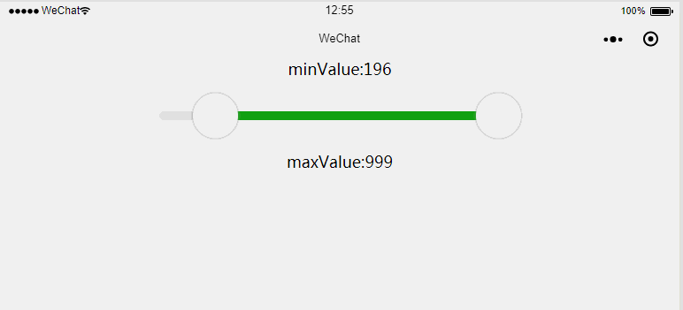

# wechat-rangeslider

微信小程序区间滑块组件

## 效果



## 目录结构

```
└─wechat-rangeslider
    │  app.js
    │  app.json
    │  app.wxss
    │  project.config.json
    │  
    ├─components //区间滑块组件代码
    │      range-slider.js
    │      range-slider.json
    │      range-slider.wxml
    │      range-slider.wxss
    │      
    └─index
            index.js
            index.json
            index.wxml
            index.wxss
```

## 使用方法

1.安装 range-slider

将components文件夹拷贝到项目中。

2.在需要使用 range-slider 的页面 page.json 中添加 range-slider 自定义组件配置

```
{
  "usingComponents": {
    "range-slider": "/components/range-slider"
  }
}
```

3.WXML 文件中引用 range-slider
```
  <range-slider width='400' height='80' block-size='50' min='99' max='999' values='{{rangeValues}}' bind:rangechange='onRangeChange'>
    <view slot='minBlock' class='range-slider-block'></view> //左边滑块的内容
    <view slot='maxBlock' class='range-slider-block'></view> //右边滑块的内容
  </range-slider>
```

## range-slider属性

| 属性名 | 类型 | 默认值 | 说明 |
|---|---|---|---|
| width | Number | 750 | 组件宽度(rpx)|
| height |Number |100 | 组件高度(rpx) |
| block-size | Number | 50 | 滑块大小(rpx) |
| bar-height | Number | 10 | 进度条高度(rpx) |
| background-color | String | #e9e9e9 | 进度条背景色 |
| active-color | String | #1aad19 | 已选择的颜色 |
| min | Number | 0 | 最小值 |
| max |Number | 100 | 最大值 |
| bindrangechange | EventHandle | 完成一次拖动后触发的事件，event.detail = {minValue: value1,maxValue:value2} |
